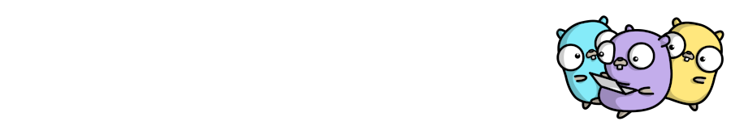

### Hi there 👋

<!-- ## About Me 

 -->

I'm Roman - software developer, music listener.
<!-- 
## Domains

- Web Development 
- Performance Optimizations
- Problem Solving
- Software Architecture

## Technologies

- Go
- Python
- Databases -->

<!--
**tty2/tty2** is a ✨ _special_ ✨ repository because its `README.md` (this file) appears on your GitHub profile.

Here are some ideas to get you started:

- 🔭 I’m currently working on ...
- 🌱 I’m currently learning ...
- 👯 I’m looking to collaborate on ...
- 🤔 I’m looking for help with ...
- 💬 Ask me about ...
- 📫 How to reach me: ...
- 😄 Pronouns: ...
- ⚡ Fun fact: ...
-->
